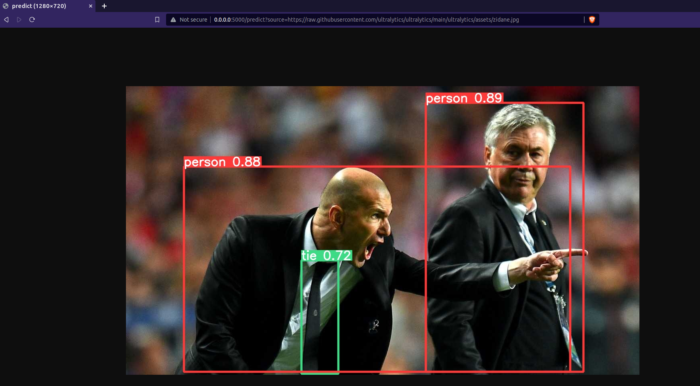

<div align="center">
  
</div>

# Ultralytics Flask API for detection and segmentation

<div align="center">
  <a href="https://www.buymeacoffee.com/hdnh2006" target="_blank">
    
  </a>
</div>


This code is based on the Ultralytics repo and it has all the functionalities that the original code has:
- Different source: images, videos, webcam, RTSP cameras.
- All the weights are supported: TensorRT, Onnx, DNN, openvino.

The API can be called in an interactive way, and also as a single API called from terminal and it supports all the tasks provided by Ultralytics (detection, segmentation, classification and pose estimation) in the same API!!!!

All [models](https://github.com/ultralytics/ultralytics/tree/main/ultralytics/cfg/models) download automatically from the latest Ultralytics [release](https://github.com/ultralytics/assets/releases) on first use.


## Requirements

Python 3.8 or later with all [requirements.txt](requirements.txt) dependencies installed, including `torch>=1.7`. To install run:

```bash
$ pip3 install -r requirements.txt
```

## [Detection](https://docs.ultralytics.com/tasks/detect), [Segmentation](https://docs.ultralytics.com/tasks/segment), [Classification](https://docs.ultralytics.com/tasks/classify) and [Pose Estimation](https://docs.ultralytics.com/tasks/pose) models pretrained on the [COCO](https://docs.ultralytics.com/datasets/detect/coco) in the same API

`predict_api.py` can deal with several sources and can run into the cpu, but it is highly recommendable to run in gpu.

```bash
Usage - formats:
    $ python predict_api.py --weights yolov8s.pt                # PyTorch
                                     yolov8s.torchscript        # TorchScript
                                     yolov8s.onnx               # ONNX Runtime or OpenCV DNN with --dnn
                                     yolov8s_openvino_model     # OpenVINO
                                     yolov8s.engine             # TensorRT
                                     yolov8s.mlmodel            # CoreML (macOS-only)
                                     yolov8s_saved_model        # TensorFlow SavedModel
                                     yolov8s.pb                 # TensorFlow GraphDef
                                     yolov8s.tflite             # TensorFlow Lite
                                     yolov8s_edgetpu.tflite     # TensorFlow Edge TPU
                                     yolov8s_paddle_model       # PaddlePaddle

Usage - tasks:
    $ python predict_api.py --weights yolov8s.pt                # Detection
                                     yolov8s-seg.pt             # Segmentation
                                     yolov8s-cls.pt             # Classification
                                     yolov8s-pose.pt            # Pose Estimation
```

## Interactive implementation implemntation

You can deploy the API able to label an interactive way.

Run:

```bash
$ python predict_api.py --device cpu # to run into cpu (by default is gpu)
```
Open the application in any browser 0.0.0.0:5000 and upload your image or video as is shown in video above.


## How to use the API

### Interactive way
Just open your favorite browser and go to 0.0.0.0:5000 and intuitevely load the image you want to label and press the buttom "Upload image".

The API will return the image or video labeled.



All tasks are supported, for pose estimation, resutls should be as follow:


### Call from terminal or python script
The `client.py` code provides several example about how the API can be called. A very common way to do it is to call a public image from url and to get the coordinates of the bounding boxes:

```python
import requests

resp = requests.get("http://0.0.0.0:5000/predict?source=https://raw.githubusercontent.com/ultralytics/ultralytics/main/ultralytics/assets/zidane.jpg&save_txt=T",
                    verify=False)
print(resp.content)

```
And you will get a json with the following data:

```
b'{"results": [{"name": "person", "class": 0, "confidence": 0.8892598748207092, "box": {"x1": 747.315673828125, "y1": 41.47210693359375, "x2": 1140.3927001953125, "y2": 712.91650390625}}, {"name": "person", "class": 0, "confidence": 0.8844665288925171, "box": {"x1": 144.88815307617188, "y1": 200.0352783203125, "x2": 1107.232177734375, "y2": 712.7000732421875}}, {"name": "tie", "class": 27, "confidence": 0.7176544070243835, "box": {"x1": 437.38336181640625, "y1": 434.477294921875, "x2": 529.9751586914062, "y2": 717.05126953125}}]}'
```

In the case of pose estimation results are like this:
```
b'{"results": [{"name": "person", "class": 0, "confidence": 0.9490957260131836, "box": {"x1": 239.0, "y1": 15.0, "x2": 1018.0, "y2": 1053.0}, "keypoints": {"x": [604.9951782226562, 653.2091064453125, 552.5707397460938, 697.6889038085938, 457.49749755859375, 786.6876831054688, 358.194091796875, 954.072998046875, 488.3907775878906, 684.831298828125, 802.8469848632812, 687.2332153320312, 412.4287414550781, 924.52685546875, 632.3346557617188, 811.2559814453125, 768.5433349609375], "y": [316.5501403808594, 260.7156066894531, 257.27691650390625, 291.1667175292969, 285.6615905761719, 566.11962890625, 596.4549560546875, 909.6119384765625, 965.7925415039062, 997.584716796875, 841.6057739257812, 1066.0, 1066.0, 850.1934204101562, 812.7511596679688, 954.5965576171875, 951.3284912109375], "visible": [0.9959749579429626, 0.9608340859413147, 0.9934138655662537, 0.4281827211380005, 0.9349473118782043, 0.9848191738128662, 0.9723504185676575, 0.8565006852149963, 0.8561225533485413, 0.9004713296890259, 0.9377612471580505, 0.10934382677078247, 0.08168646693229675, 0.008380762301385403, 0.008864155039191246, 0.0017155600944533944, 0.001865472993813455]}}]}'
```


## TODO
- [ ] Return txt values for videos
- [ ] save folder according to task: detect, pose, segment, ...
- [ ] Support any other model: SAM, RTDETR, NAS.
- [ ] Docker files
- [ ] Improve index template


## About me and contact

This code is based on the Ultralytics code and it has been modified by Henry Navarro
 
If you want to know more about me, please visit my blog: [henrynavarro.org](https://henrynavarro.org).
